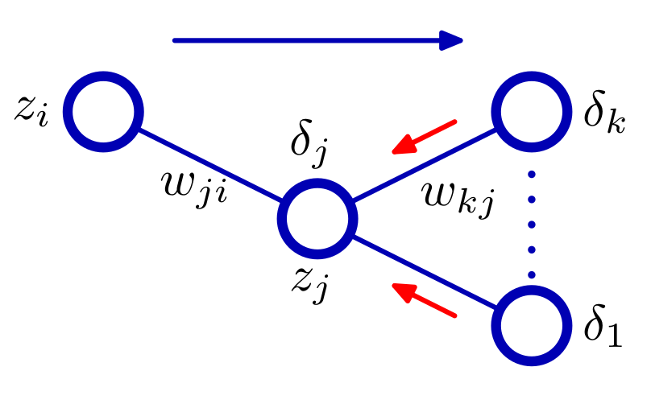

# Implementation for Backward propagation

> Give 2 fully connected layers and cross entropy loss function, implement back-propagation for MNIST dataset

- Input: (32, 32, 1) ==Model==> Output: (10)

## Backward propagation

- Cross Entropy Loss L = $\sum_i t_i ln(y_i) + (1-t_i) ln(1-y_i)$
- Denote: $E = \text{Expected Loss}$
- $y_k = h(a_k) = h(\sum_i w_{ki}^Tz_i)$

_Derivative of $E_n$ with respect to weight $w_{ji}$:\_

- Use chain rule with $a_j = \sum_i w_{ji}^T z_i$

$$
\frac{\partial E_n}{\partial w_{ji}} = \frac{\partial L}{\partial a_j} \frac{\partial a_j}{\partial w_{ji}} = \delta_j z_i
$$

where

$$
\delta_j = \frac{\partial E_n}{\partial a_{j}}
$$

_For output layer:_

$$
\delta_k = y_k - t_k
$$

_For hidden layer:_

- Chain rule with activation of next layer

$$
\delta_j = \frac{\partial E_n}{\partial a_{j}} = \sum_k  \frac{\partial E_n}{\partial a_{k}}  \frac{\partial a_{k}}{\partial a_{j}} = h'(a_j) * \sum_k \delta_k @ w_{kj}^T
$$

where

$$
a_k = \sum_j w_{kj}^T z_j = \sum_j w_{kj}^T h(a_j)     \newline
a_k \sim w_{kj} h(a_j)
$$

## Implementation

### Implementation for Linear layer

_Each linear layer index $i$ has following attributes:_

- Basis attributes:
- [x] Model name
- [x] Input dimension
- [x] Output dimension
- [x] Learning rate $\eta$
- [x] Activation function $h(x)$
- [x] Previous layer $Linear^{i-1}$
- [x] Next layer $Linear^{i+1}$
- Forward pass:
- [x] Activation value $a = w^Tz_{prev-layer}$
- [x] Layer output $z = h(a)$
- Backward pass:
- [x] Derivatives of $L$ respect to weight $w$. Denote $dW$
- [x] Derivatives of $L$ respect to bias $b$. Denote $db$
- [x] delta $\delta$

### Implementation for MyModel

> MyModel is 2 fully connected layers

- Basic attributes:
- [x] Architecture information
- [x] Input data size
- [x] Loss function
- [x] Train dataset
- [x] Train targets
- [x] Learning rate
